  <picture>
    <source media="(max-width: 600px)" srcset="./assets/professional-hero-mobile-v9.svg">
    
  </picture>

  <a href="mailto:egor_spaik05@mail.ru"><strong>EMAIL</strong></a>
  &nbsp;&nbsp;·&nbsp;&nbsp;
  <a href="https://t.me/Inga1e"><strong>TELEGRAM</strong></a>
  &nbsp;&nbsp;·&nbsp;&nbsp;
  <a href="https://gitlab.com/Ingaleee"><strong>GITLAB</strong></a>
  &nbsp;&nbsp;·&nbsp;&nbsp;
  <a href="https://github.com/Ingaleee?tab=repositories"><strong>REPOSITORIES</strong></a>

  <picture>
    <source media="(max-width: 600px)" srcset="./assets/evidence-stream-mobile-dark.svg">
    
  </picture>

## Selected systems

| System | Engineering focus | Stack |
|---|---|---|
| **B2B catalog and media platform** | High-performance search, event-driven processing, observability and delivery ownership | .NET 9, PostgreSQL, Kafka, Redis, MongoDB, Kubernetes |
| **Cybersecurity AI/RAG platform** | Versioned knowledge bases, asynchronous LLM execution and analytical routing | ASP.NET Core, pgvector, HNSW, Kafka, ClickHouse |
| **POS lending and payment orchestration** | Idempotent callbacks, status machines, reconciliation and provider integrations | C#, SQL Server, REST, payments, transactional workflows |

## Independent engineering

- **TrustHub** — Go backend for a TON escrow platform with explicit deal state machines, arbitration, reputation and operational monitoring.
- **MPLX** — C++20 compiler, bytecode virtual machine, language tooling and a stable .NET interop boundary.
- **VPN platform** — Manifest V3 browser extension and subscription lifecycle for VLESS and WireGuard infrastructure.

  
<strong>Experience and technical scope</strong>

   

  **Experience:** Wilo SE · Sber Cybersecurity · EGAR International · Geropharm

  **Backend:** C#, .NET 6—9, ASP.NET Core, EF Core, Dapper, LINQ, BackgroundService  
  **Architecture:** Microservices, DDD, Clean Architecture, CQRS, event-driven systems, REST, gRPC  
  **Data:** PostgreSQL, SQL Server, MongoDB, ClickHouse, Redis  
  **Platform:** Kafka, RabbitMQ, Docker, Kubernetes, OpenTelemetry, Prometheus, Grafana, ELK  
  **Security:** Keycloak, OAuth2, OIDC, JWT, TLS, mTLS, rate limiting and secure logging  
  **Frontend:** React, TypeScript, Next.js and data-intensive interfaces

 

  Open to relocation and international remote contracts.

