  <picture>
    <source media="(max-width: 600px) and (prefers-color-scheme: light)" srcset="./assets/command-center-mobile-light.svg">
    <source media="(max-width: 600px)" srcset="./assets/command-center-mobile-dark.svg">
    <source media="(prefers-color-scheme: light)" srcset="./assets/command-center-light.svg">
    
  </picture>

  <a href="mailto:egor_spaik05@mail.ru"><strong>EMAIL</strong></a>
  &nbsp;&nbsp;·&nbsp;&nbsp;
  <a href="https://t.me/Inga1e"><strong>TELEGRAM</strong></a>
  &nbsp;&nbsp;·&nbsp;&nbsp;
  <a href="https://gitlab.com/Ingaleee"><strong>GITLAB</strong></a>
  &nbsp;&nbsp;·&nbsp;&nbsp;
  <a href="https://github.com/Ingaleee?tab=repositories"><strong>REPOSITORIES</strong></a>

  
<strong>OPEN TECHNICAL DOSSIER</strong>

   

  **Production systems**

  - **B2B catalog and media platform** — search, BOM trees, asynchronous media processing and observability across 100K–1M SKU.
  - **Cybersecurity AI/RAG platform** — versioned knowledge bases, pgvector/HNSW retrieval, Kafka-based LLM execution and ClickHouse analytics.
  - **POS lending and payments** — transactional state machines, idempotent callbacks, reconciliation and resilient provider integrations.

  **Independent engineering**

  - **TrustHub** — Go backend for a TON escrow platform with deal state machines, arbitration and reputation.
  - **MPLX** — C++20 compiler, bytecode VM, language tooling and a stable .NET interop boundary.
  - **VPN platform** — Manifest V3 extension and subscription lifecycle for VLESS and WireGuard infrastructure.

  **Core system**

  `C#` · `.NET 6—9` · `ASP.NET Core` · `PostgreSQL` · `SQL Server` · `Redis` · `Kafka` · `RabbitMQ` · `Docker` · `Kubernetes` · `OpenTelemetry`

 

  Production backend engineering · Highload · Distributed systems · FinTech · AI/RAG

