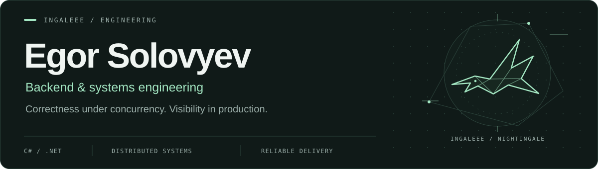

<picture>
  <source media="(max-width: 600px) and (prefers-color-scheme: light)" srcset="./assets/profile-header-mobile-light.svg">
  <source media="(max-width: 600px)" srcset="./assets/profile-header-mobile-dark.svg">
  <source media="(prefers-color-scheme: light)" srcset="./assets/profile-header-light.svg">
  
</picture>

### Senior C#/.NET Backend Engineer

I build backend systems where concurrency, data integrity and failure recovery matter: real-time pipelines, event-driven services, payment workflows and AI/RAG infrastructure. I work across architecture, implementation and operations.

**[Email](mailto:egor_spaik05@mail.ru)** · **[Telegram](https://t.me/Inga1e)** · [GitLab](https://gitlab.com/Ingaleee) 
Open to international remote contracts and relocation.

---

## Featured product / [TrustHub](https://gitlab.com/Ingaleee/trusthub-backend)

**TON escrow platform · Go backend + Tact contracts**

My Go backend connects Telegram identity, reputation, search and notifications to TON escrow contracts. On-chain modules cover deal creation, escrow state transitions and arbitration; off-chain code handles contract payloads and acknowledgements.

`Go` `Tact / TON` `PostgreSQL` `Redis` `OpenSearch`

[Backend](https://gitlab.com/Ingaleee/trusthub-backend) · [Smart contracts](https://gitlab.com/Ingaleee/smart/-/tree/main/application/contracts) · [TON integration](https://gitlab.com/Ingaleee/trusthub-backend/-/tree/main/internal/onchain) · [Backend tests](https://gitlab.com/Ingaleee/trusthub-backend/-/tree/main/tests/integration)

## Selected engineering

Four public projects, with a starting point for reviewing the code and the decisions behind it.

### 01 / [Market tick ingestion](https://github.com/Ingaleee/market-tick-ingestion)

A reproducible real-time ingestion service with three simulated exchange feeds. Bounded queues apply backpressure; reconnects, two-stage deduplication and PostgreSQL batch writes handle interruptions and duplicate data.

`C#` `.NET 10` `WebSockets` `PostgreSQL` `Docker`

[Pipeline](https://github.com/Ingaleee/market-tick-ingestion/tree/main/src/MarketData.Application/Ingestion) · [Concurrency tests](https://github.com/Ingaleee/market-tick-ingestion/blob/main/tests/MarketData.Application.Tests/Ingestion/TickIngestionConcurrencyTests.cs) · [Run locally](https://github.com/Ingaleee/market-tick-ingestion#как-запустить)

### 02 / [MPLX](https://github.com/Ingaleee/MPLX)

A programming language experiment spanning the compiler, bytecode VM and developer tooling. Explore the runtime implementation, language tests and native C API / .NET interop boundary.

`C++20` `C#` `CMake` `TypeScript` `LSP`

[Compiler](https://github.com/Ingaleee/MPLX/tree/main/Application/mplx-compiler) · [Virtual machine](https://github.com/Ingaleee/MPLX/tree/main/Application/mplx-vm) · [Language tests](https://github.com/Ingaleee/MPLX/tree/main/Presentation/tests-cpp)

### 03 / [MESH showcase](https://github.com/Ingaleee/MESH-showcase)

A creator marketplace and delivery lab: versioned work, payment simulation, idempotent integrations and failure recovery. The evidence index records the tested revisions, CI runs, deployment exercises and their limits.

`Ruby / Rails` `Next.js` `PostgreSQL` `GitHub Actions` `Kubernetes`

[Integration & release lab](https://github.com/Ingaleee/MESH-showcase/blob/main/docs/publishing-lab.md) · [Execution evidence](https://github.com/Ingaleee/MESH-showcase/blob/main/docs/execution-status.md) · [Architecture decisions](https://github.com/Ingaleee/MESH-showcase/blob/main/docs/adr.md)

### 04 / [FusionOps](https://github.com/Ingaleee/FusionOps)

An operations backend exploring resource allocation, event-based audit and read projections. Review the outbox dispatcher, EventStoreDB-to-PostgreSQL projector and end-to-end audit tests.

`C# / .NET` `EventStoreDB` `PostgreSQL` `RabbitMQ` `GraphQL`

[Outbox](https://github.com/Ingaleee/FusionOps/blob/main/FusionOps.Presentation/BackgroundServices/OutboxDispatcher.cs) · [Projector](https://github.com/Ingaleee/FusionOps/tree/main/FusionOps.Infrastructure/Projector) · [Integration tests](https://github.com/Ingaleee/FusionOps/tree/main/FusionOps.EventStore.IntegrationTests)

---

## How I approach systems

- **Start with invariants.** Make state transitions, ownership and consistency rules explicit; test the races and duplicate deliveries.
- **Design the failure path.** Bound queues, propagate cancellation and make retries, reconciliation and recovery observable.
- **Close the delivery loop.** Connect code and architecture decisions to repeatable tests, deployment checks and operational evidence.

  
<strong>Commercial experience & technical scope</strong>

### Commercial experience

Wilo SE · Sber Cybersecurity · EGAR International · Geropharm

The systems below describe my commercial work; the public projects above provide independently inspectable code.

| Area | Engineering focus |
| --- | --- |
| B2B catalog & media | Search performance, event-driven processing, observability and delivery |
| Cybersecurity AI/RAG | Versioned knowledge bases, asynchronous LLM execution, vector search and analytical routing |
| POS lending & payments | Idempotent callbacks, state machines, reconciliation and provider integrations |

### Core stack

**Backend:** C#, ASP.NET Core, EF Core, Dapper, background services, REST, gRPC 
**Data & messaging:** PostgreSQL, SQL Server, Redis, MongoDB, ClickHouse, Kafka, RabbitMQ 
**Architecture:** DDD, CQRS, event-driven systems, microservices, Clean Architecture 
**Operations:** Docker, Kubernetes, OpenTelemetry, Prometheus, Grafana, CI/CD 
**Security:** OAuth2 / OIDC, Keycloak, JWT, TLS / mTLS, rate limiting 
**Beyond .NET:** Go, C++20, Ruby / Rails, React, TypeScript, Next.js

### More code

[Aiti Guru backend](https://gitlab.com/Ingaleee/aiti_guru_backend) — Python / FastAPI commerce and logistics API with PostgreSQL, Redis, transactional stock updates and order-service tests.

[All repositories](https://github.com/Ingaleee?tab=repositories) · Questions about a project or a backend role? [Get in touch](mailto:egor_spaik05@mail.ru).
