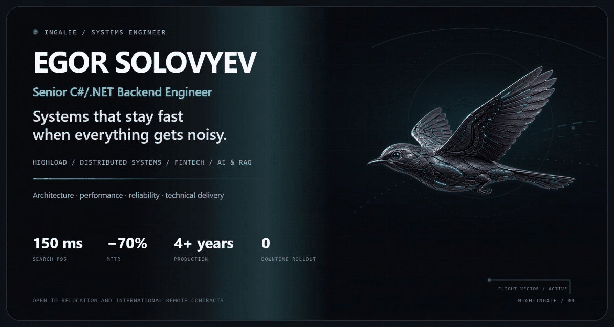

  <picture>
    <source media="(prefers-reduced-motion: reduce) and (max-width: 600px)" srcset="./assets/professional-hero-mobile-still-v15.webp">
    <source media="(prefers-reduced-motion: reduce)" srcset="./assets/professional-hero-still-v15.webp">
    <source media="(max-width: 600px)" type="image/webp" srcset="./assets/professional-hero-mobile-animated-v15.webp">
    <source media="(max-width: 600px)" srcset="./assets/professional-hero-mobile-animated-v14.gif">
    <source type="image/webp" srcset="./assets/professional-hero-animated-v15.webp">
    
  </picture>

  <a href="mailto:egor_spaik05@mail.ru"><strong>EMAIL</strong></a>
  &nbsp;&nbsp;·&nbsp;&nbsp;
  <a href="https://t.me/Inga1e"><strong>TELEGRAM</strong></a>
  &nbsp;&nbsp;·&nbsp;&nbsp;
  <a href="https://gitlab.com/users/Ingaleee/projects"><strong>GITLAB</strong></a>
  &nbsp;&nbsp;·&nbsp;&nbsp;
  <a href="https://github.com/Ingaleee?tab=repositories"><strong>REPOSITORIES</strong></a>
  &nbsp;&nbsp;·&nbsp;&nbsp;
  <a href="#user-content-independent-engineering"><strong>PROJECTS &amp; CODE</strong></a>

  <picture>
    <source media="(prefers-reduced-motion: reduce) and (max-width: 600px)" srcset="./assets/evidence-stream-mobile-still-dark.svg">
    <source media="(prefers-reduced-motion: reduce)" srcset="./assets/evidence-stream-still-dark.svg">
    <source media="(max-width: 600px)" srcset="./assets/evidence-stream-mobile-dark.svg">
    
  </picture>

## Selected systems

**Senior C#/.NET backend engineer** focused on search, event-driven processing, payments and reliable delivery.

| System | Engineering focus | Stack |
|---|---|---|
| **B2B catalog and media platform** | **Search p95: 150 ms** at 100K–1M SKU; event-driven processing, observability and delivery ownership | .NET 9, PostgreSQL, Kafka, Redis, MongoDB, Kubernetes |
| **Cybersecurity AI/RAG platform** | **Zero-downtime rollouts** of versioned knowledge bases; asynchronous LLM execution and analytical routing | ASP.NET Core, pgvector, HNSW, Kafka, ClickHouse |
| **POS lending and payment orchestration** | Idempotent callbacks, status machines, reconciliation and provider integrations | C#, SQL Server, REST, payments, transactional workflows |

**Operational impact:** MTTR reduced by **70%** through distributed tracing, alerts and runbooks.

## Independent engineering

- **[TrustHub](https://gitlab.com/Ingaleee/trusthub-backend)** — TON escrow platform with a Go backend and Tact smart contracts. Explicit deal state machines, arbitration and reputation; Telegram identity, notifications, OpenSearch, operational monitoring and on-chain acknowledgements. 
  [Go backend](https://gitlab.com/Ingaleee/trusthub-backend) · [Tact contracts](https://gitlab.com/Ingaleee/smart/-/tree/main/application/contracts) · [TON integration](https://gitlab.com/Ingaleee/trusthub-backend/-/tree/main/internal/onchain) · [Backend integration tests](https://gitlab.com/Ingaleee/trusthub-backend/-/tree/main/tests/integration)
- **[MPLX](https://github.com/Ingaleee/MPLX)** — C++20 compiler, bytecode virtual machine, language tooling and a stable .NET interop boundary. 
  [Compiler](https://github.com/Ingaleee/MPLX/tree/main/Application/mplx-compiler) · [Virtual machine](https://github.com/Ingaleee/MPLX/tree/main/Application/mplx-vm) · [Language tests](https://github.com/Ingaleee/MPLX/tree/main/Presentation/tests-cpp) · [GitLab](https://gitlab.com/Ingaleee/mplx)
- **VPN platform** — Manifest V3 browser extension and subscription lifecycle for VLESS and WireGuard infrastructure.

### More public engineering

| Project | What to inspect |
|---|---|
| **[Market tick ingestion](https://github.com/Ingaleee/market-tick-ingestion)** C# / .NET 10 · PostgreSQL | Three simulated WebSocket feeds, bounded queues, reconnects, deduplication and batch writes. [Pipeline](https://github.com/Ingaleee/market-tick-ingestion/tree/main/src/MarketData.Application/Ingestion) · [Concurrency tests](https://github.com/Ingaleee/market-tick-ingestion/blob/main/tests/MarketData.Application.Tests/Ingestion/TickIngestionConcurrencyTests.cs) |
| **[MESH showcase](https://github.com/Ingaleee/MESH-showcase)** Ruby / Rails · Next.js · PostgreSQL | Creator marketplace with payment simulation, idempotent integrations, deployment and recovery exercises. [Integration & release lab](https://github.com/Ingaleee/MESH-showcase/blob/main/docs/publishing-lab.md) · [Execution evidence](https://github.com/Ingaleee/MESH-showcase/blob/main/docs/execution-status.md) |
| **[FusionOps](https://github.com/Ingaleee/FusionOps)** C# / .NET · EventStoreDB · PostgreSQL | Resource allocation, event-based audit, outbox delivery and read projections. [Outbox](https://github.com/Ingaleee/FusionOps/blob/main/FusionOps.Presentation/BackgroundServices/OutboxDispatcher.cs) · [Projector](https://github.com/Ingaleee/FusionOps/tree/main/FusionOps.Infrastructure/Projector) · [GitLab](https://gitlab.com/Ingaleee/fusionops) |
| **[Aiti Guru backend](https://gitlab.com/Ingaleee/aiti_guru_backend)** Python / FastAPI · PostgreSQL · Redis | Commerce and logistics API, transactional stock updates and order management. [Order service](https://gitlab.com/Ingaleee/aiti_guru_backend/-/blob/main/src/application/services/order_service.py) · [Tests](https://gitlab.com/Ingaleee/aiti_guru_backend/-/tree/main/tests) |

Commercial systems above describe my professional experience. These public repositories provide code, architecture and verification material to explore.

  
<strong>Experience and technical scope</strong>

   

  **Experience:** Wilo SE · Sber Cybersecurity · EGAR International · Geropharm

  **Backend:** C#, .NET 6–10, ASP.NET Core, EF Core, Dapper, LINQ, BackgroundService 
  **Architecture:** Microservices, DDD, Clean Architecture, CQRS, event-driven systems, REST, gRPC  
  **Data:** PostgreSQL, SQL Server, MongoDB, ClickHouse, Redis  
  **Platform:** Kafka, RabbitMQ, Docker, Kubernetes, OpenTelemetry, Prometheus, Grafana, ELK  
  **Security:** Keycloak, OAuth2, OIDC, JWT, TLS, mTLS, rate limiting and secure logging  
  **Frontend:** React, TypeScript, Next.js and data-intensive interfaces

  **Independent stack:** Go, Tact / TON, C++20, Python / FastAPI, Ruby / Rails

 

  Open to relocation and international remote contracts.
   
  <a href="mailto:egor_spaik05@mail.ru">Email</a> &nbsp;·&nbsp; <a href="https://t.me/Inga1e">Telegram</a>

