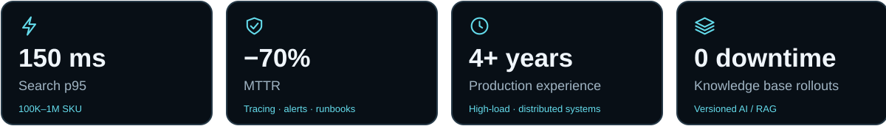
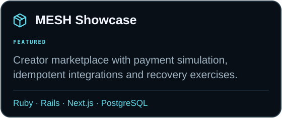
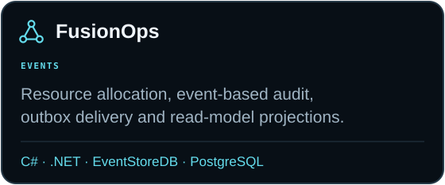
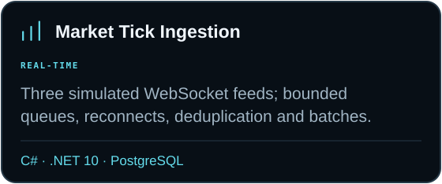
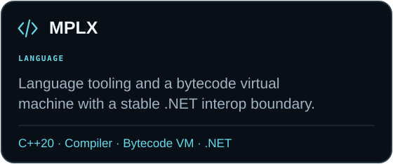
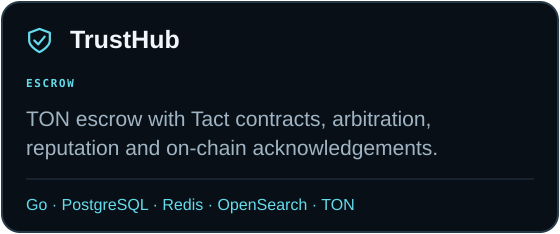
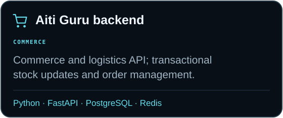
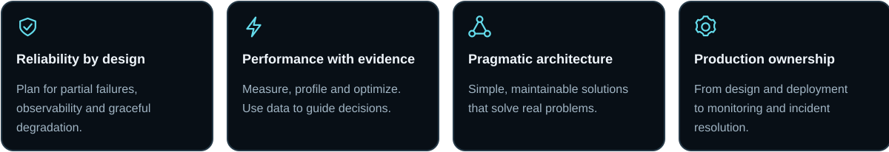

  
  
  
  
  
   
  Open to relocation and international remote contracts.

  <picture>
    <source media="(prefers-reduced-motion: reduce) and (max-width: 600px)" srcset="./assets/profile-hero-mobile-still-v17.svg">
    <source media="(prefers-reduced-motion: reduce)" srcset="./assets/profile-hero-still-v17.svg">
    <source media="(max-width: 600px)" srcset="./assets/profile-hero-mobile-v17.svg">
    
  </picture>
  <picture>
    <source media="(max-width: 600px)" srcset="./assets/profile-metrics-mobile-v17.svg">
    
  </picture>

## About me

I'm a **Senior C#/.NET backend engineer with 4+ years of production experience** across industrial platforms, cybersecurity and fintech. I build systems that remain reliable under load, partial failures and changing requirements.

My focus is **performance, reliability, clean architecture and measurable impact**: distributed systems, event-driven processing, payments, observability and production support. I take ownership from architecture and implementation through deployment, monitoring and incident resolution.

**Experience:** Wilo SE · Sber Cybersecurity · EGAR International · Geropharm

## Selected systems

| System | Engineering focus | Stack |
|---|---|---|
| **B2B catalog and media platform** | **Search p95: 150 ms** at 100K–1M SKU; event-driven processing, observability and delivery ownership | .NET 9, PostgreSQL, Kafka, Redis, MongoDB, Kubernetes |
| **Cybersecurity AI/RAG platform** | **Zero-downtime rollouts** of versioned knowledge bases; asynchronous LLM execution and analytical routing | ASP.NET Core, pgvector, HNSW, Kafka, ClickHouse |
| **POS lending and payment orchestration** | Idempotent callbacks, status machines, reconciliation and provider integrations | C#, SQL Server, REST, payments, transactional workflows |

**Operational impact:** MTTR reduced by **70%** through distributed tracing, alerts and runbooks.

## Independent engineering

**Featured engineering projects** — inspect the source, architecture and verification material. [All GitHub repositories →](https://github.com/Ingaleee?tab=repositories) · [GitLab projects →](https://gitlab.com/users/Ingaleee/projects)

<table>
<tr>
<td width="50%" valign="top">
  
  
<a href="https://github.com/Ingaleee/MESH-showcase#readme"><strong>Overview</strong></a> &nbsp;·&nbsp; <a href="https://github.com/Ingaleee/MESH-showcase/tree/main/apps"><strong>Code</strong></a>

  

Engineering details &amp; evidence

    
Creator marketplace with payment simulation, idempotent integrations, deployment and recovery exercises.

    
<a href="https://github.com/Ingaleee/MESH-showcase/blob/main/docs/publishing-lab.md">Integration &amp; release lab</a> · <a href="https://github.com/Ingaleee/MESH-showcase/blob/main/docs/execution-status.md">Execution evidence</a>

  

</td>
<td width="50%" valign="top">
  
  
<a href="https://github.com/Ingaleee/FusionOps#readme"><strong>Overview</strong></a> &nbsp;·&nbsp; <a href="https://github.com/Ingaleee/FusionOps/tree/main/FusionOps.Application"><strong>Code</strong></a>

  

Engineering details &amp; evidence

    
Resource allocation, event-based audit, outbox delivery and read projections.

    
<a href="https://github.com/Ingaleee/FusionOps/blob/main/FusionOps.Presentation/BackgroundServices/OutboxDispatcher.cs">Outbox</a> · <a href="https://github.com/Ingaleee/FusionOps/tree/main/FusionOps.Infrastructure/Projector">Projector</a> · <a href="https://gitlab.com/Ingaleee/fusionops">GitLab</a>

  

</td>
</tr>
<tr>
<td width="50%" valign="top">
  
  
<a href="https://github.com/Ingaleee/market-tick-ingestion#readme"><strong>Overview</strong></a> &nbsp;·&nbsp; <a href="https://github.com/Ingaleee/market-tick-ingestion/tree/main/src"><strong>Code</strong></a>

  

Engineering details &amp; tests

    
Three simulated WebSocket feeds, bounded queues, reconnects, deduplication and batch writes.

    
<a href="https://github.com/Ingaleee/market-tick-ingestion/tree/main/src/MarketData.Application/Ingestion">Pipeline</a> · <a href="https://github.com/Ingaleee/market-tick-ingestion/blob/main/tests/MarketData.Application.Tests/Ingestion/TickIngestionConcurrencyTests.cs">Concurrency tests</a>

  

</td>
<td width="50%" valign="top">
  
  
<a href="https://github.com/Ingaleee/MPLX#readme"><strong>Overview</strong></a> &nbsp;·&nbsp; <a href="https://github.com/Ingaleee/MPLX/tree/main/Application"><strong>Code</strong></a>

  

Engineering details &amp; tests

    
C++20 compiler, bytecode virtual machine, language tooling and a stable .NET interop boundary.

    
<a href="https://github.com/Ingaleee/MPLX/tree/main/Application/mplx-compiler">Compiler</a> · <a href="https://github.com/Ingaleee/MPLX/tree/main/Application/mplx-vm">Virtual machine</a> · <a href="https://github.com/Ingaleee/MPLX/tree/main/Presentation/tests-cpp">Language tests</a> · <a href="https://gitlab.com/Ingaleee/mplx">GitLab</a>

  

</td>
</tr>
<tr>
<td width="50%" valign="top">
  
  
<a href="https://gitlab.com/Ingaleee/trusthub-backend#readme"><strong>Overview</strong></a> &nbsp;·&nbsp; <a href="https://gitlab.com/Ingaleee/trusthub-backend/-/tree/main/internal"><strong>Code</strong></a>

  

Engineering details &amp; tests

    
TON escrow platform with a Go backend and Tact smart contracts. Explicit deal state machines, arbitration and reputation; Telegram identity, notifications, OpenSearch, operational monitoring and on-chain acknowledgements.

    
<a href="https://gitlab.com/Ingaleee/trusthub-backend">Go backend</a> · <a href="https://gitlab.com/Ingaleee/smart/-/tree/main/application/contracts">Tact contracts</a> · <a href="https://gitlab.com/Ingaleee/trusthub-backend/-/tree/main/internal/onchain">TON integration</a> · <a href="https://gitlab.com/Ingaleee/trusthub-backend/-/tree/main/tests/integration">Backend integration tests</a>

  

</td>
<td width="50%" valign="top">
  
  
<a href="https://gitlab.com/Ingaleee/aiti_guru_backend#readme"><strong>Overview</strong></a> &nbsp;·&nbsp; <a href="https://gitlab.com/Ingaleee/aiti_guru_backend/-/tree/main/src"><strong>Code</strong></a>

  

Engineering details &amp; tests

    
Commerce and logistics API, transactional stock updates and order management.

    
<a href="https://gitlab.com/Ingaleee/aiti_guru_backend/-/blob/main/src/application/services/order_service.py">Order service</a> · <a href="https://gitlab.com/Ingaleee/aiti_guru_backend/-/tree/main/tests">Tests</a>

  

</td>
</tr>
</table>

**VPN platform** — Manifest V3 browser extension and subscription lifecycle for VLESS and WireGuard infrastructure.

Commercial systems above describe my professional experience. These public repositories provide code, architecture and verification material to explore.

## Engineering principles

<picture>
  <source media="(max-width: 600px)" srcset="./assets/profile-principles-mobile-v17.svg">
  
</picture>

## Core tech stack

| Focus | Technologies &amp; practices |
|---|---|
| **Core backend** | C# · .NET 6–10 · ASP.NET Core · EF Core · Dapper · LINQ · BackgroundService · REST · gRPC · Minimal APIs |
| **Architecture &amp; distributed systems** | Microservices · DDD · Clean Architecture · CQRS · event-driven systems · Kafka · RabbitMQ · EventStoreDB |
| **Data** | PostgreSQL · SQL Server · MongoDB · ClickHouse · Redis · pgvector · HNSW |
| **Platform &amp; reliability** | Docker · Kubernetes · OpenTelemetry · Prometheus · Grafana · ELK · CI/CD · tracing · alerts · runbooks |
| **Security** | Keycloak · OAuth2 · OIDC · JWT · TLS · mTLS · rate limiting · secure logging |
| **Frontend** | React · TypeScript · Next.js · data-intensive interfaces |
| **Independent stack** | Go · Tact / TON · C++20 · Python / FastAPI · Ruby / Rails |

  
<strong>Production evidence stream</strong> — animated view of the systems above

   
  <picture>
    <source media="(prefers-reduced-motion: reduce) and (max-width: 600px)" srcset="./assets/evidence-stream-mobile-still-dark.svg">
    <source media="(prefers-reduced-motion: reduce)" srcset="./assets/evidence-stream-still-dark.svg">
    <source media="(max-width: 600px)" srcset="./assets/evidence-stream-mobile-dark.svg">
    
  </picture>

 

  Open to relocation and international remote contracts.
   
  <a href="mailto:egor_spaik05@mail.ru">Email</a> &nbsp;·&nbsp; <a href="https://t.me/Inga1e">Telegram</a>

